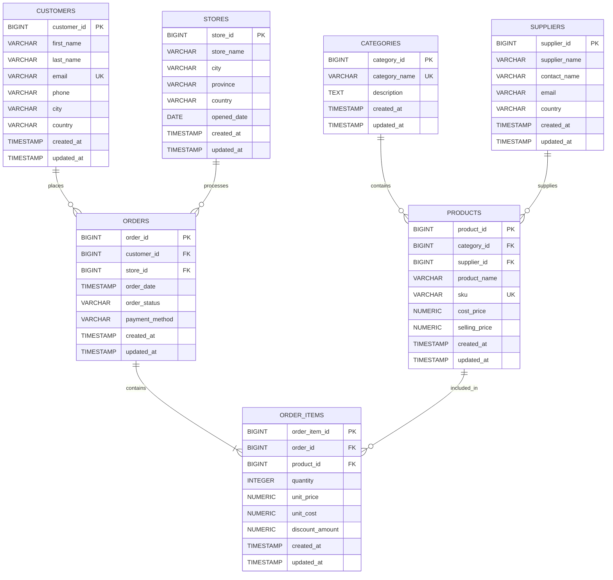
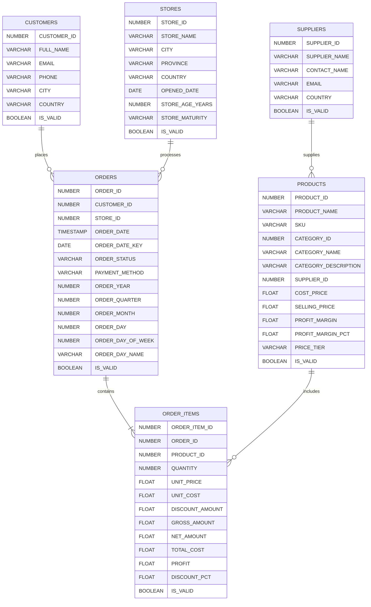
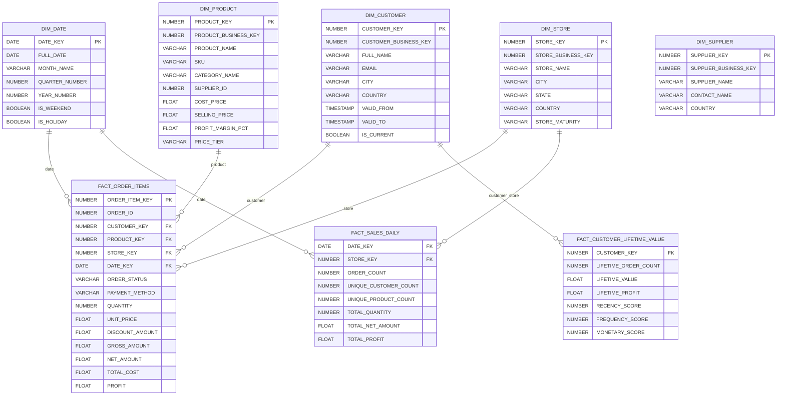

# Modern Retail Data and AI Platform: An End-to-End CDC, ELT, and Natural Language Analytical Platform Using Airbyte, Snowflake, and Langchain

---

Evan Santosa | 2026 | Portfolio Project

### I. Executive Summary

### II. Business Context

#### A. Retail Businesses Are Increasingly Data-Rich, But Decision-Poor

Modern retailers generate data across multiple operational systems, including point-of-sale transactions, product catalogs, inventory systems, suppliers, customers, promotions, and e-commerce channels. The challenge is no longer simply collecting data; it is making operational data sufficiently current, integrated, reliable, and accessible for decision-making.

A peer-reviewed study published in Production and Operations Management surveyed academic research and interviewed retail practitioners about the state of retail analytics. The study identified siloed data as the number-one barrier to successful retail analytics, alongside poor data management, weak data governance, and heterogeneous legacy systems. It also found that retailers frequently struggle to establish reliable interfaces between core operational systems such as ERP platforms and analytics environments.

This creates a structural problem:

Retail teams may have large amounts of operational data, but the data is distributed across systems, updated at different frequencies, and difficult for business users to access consistently.

#### B. Inventory Distortion Creates a Material Financial Problem

Inventory availability and accuracy are particularly important because retailers must balance two opposing risks: stockouts and overstock.

IHL Group's Fixing Inventory Distortion – Are We There Yet? estimated that worldwide retail inventory distortion would cost approximately $1.7 trillion in 2024, consisting of approximately $1.2 trillion from out-of-stocks and $554 billion from overstocks.

The problem is not merely an inventory-management issue.

Stockouts can result in lost sales and can affect future customer demand. A field experiment published in Management Science found that the adverse effects of stockouts extend beyond the immediate transaction, affecting other items within the current order and future orders.

More recent research continues to demonstrate the importance of timely operational data. A 2025 study in the Journal of Digital Economy analyzed more than 1.6 million SKUs and found that current inventory levels, recent sales, and near-term demand forecasts were among the most important predictors of stockouts.

This creates a direct business requirement for a retail data platform:

The closer analytical data is to current operational reality, the more useful it becomes for detecting inventory and sales problems.

#### C. Retail Analytics Requires Both Data Integration and Accessibility

Solving the data problem requires more than simply loading information into a warehouse.

The retail analytics literature highlights three connected challenges:

##### 1. Data fragmentation

Operational information exists across different applications and databases, creating disconnected views of customers, products, transactions, inventory, and suppliers.

##### 2. Data freshness

Changes occurring in operational systems need to propagate into analytical systems without excessive delay, particularly for transaction and inventory use cases.

##### 3. Data accessibility

Even when data has been centralized, business users may still depend on analysts or data engineers to formulate SQL queries.

Recent research indicates that natural-language interfaces can reduce this barrier. A 2025 study evaluating natural-language database interfaces against Snowflake found that users using a SQL-LLM interface completed realistic querying tasks 10–30% faster on average and achieved higher accuracy than users working directly with traditional SQL workflows.

Research specifically focused on retail is moving in the same direction. A 2026 study on LLM-driven business intelligence for retail digital transformation proposes a retail BI architecture that combines enterprise data, knowledge grounding, multi-step reasoning, executable SQL generation, and decision-oriented analysis through natural-language interaction.

Therefore, the business opportunity is not simply build a data warehouse. It is:

Build a trusted analytical data foundation that continuously integrates operational changes and allows business users to interact with retail data using natural language.

### III. Problem Statement

A representative modern retail organization operates multiple transactional and operational systems for sales, inventory, products, customers, suppliers, and stores. These systems produce valuable data continuously, but the data is fragmented across heterogeneous sources and is not always available in an integrated analytical environment.

The resulting environment creates three major business problems.

#### 1. Fragmented data prevents a unified view of the business

Sales, product, customer, supplier, and inventory information may reside in different operational databases or applications. Business users therefore lack a consistent, integrated view of retail performance.

This is consistent with retail analytics research identifying siloed data as the most frequently cited barrier to successful retail analytics.

#### 2. Delayed data reduces the usefulness of operational analytics

When data is transferred through periodic batch processes, changes in transactions, inventory, or product information may not become available in the analytical environment quickly enough.

This is particularly problematic for inventory analysis because recent sales and current inventory conditions are important indicators of stockout risk.

#### 3. Manual analytical workflows create dependency on technical teams

Business users often understand the business question but not the database structure or SQL required to answer it.

For example, a manager may understand:
"Show me the stores whose revenue declined by more than 10% compared with last month"

However, answering that question may require knowledge of multiple tables, joins, date dimensions, aggregation logic, metric definitions, and SQL syntax.

This creates an analytical bottleneck between business users and data teams.

### IV. Project Objectives

Build a production-oriented reference architecture for a modern retail data platform that transforms operational retail data into a trusted, continuously updated, and AI-accessible analytical environment.

### V. Requirements

#### A. Functional Requirements

##### 1. Source Data Integration

The platform shall ingest retail data from operational source.

##### 2. Change Data Capture

The platform shall capture changes from supported source system, including:

- INSERT
- UPDATE
- DELETE

##### 3. Raw Data Storage

Raw or minimally transformed source data shall be stored in Snowflake before analytical transformation.

##### 4. ELT Transformation

The platform shall transform raw data into analytics-ready datasets inside Snowflake.

##### 5. Analytical Data Model

The platform shall provide a curated analytical model optimized for retail analysis.

##### 6. Natural Language Analytical Interface

The platform shall expose an analytical interface through which users can ask questions using natural language.

#### B. Non-Functional Requirements

##### 1. Security

The analytical agent shall not receive unrestricted access to the Snowflake environment.

Security requirements should include:

- least-privilege database roles
- read-only analytical access for the AI agent
- separation between ingestion and analytical credentials
- credential secrets stored outside source code
- controlled tool access

##### 2. Auditability

For every AI analytical request, the system should be able to record:

- user question
- generated SQL
- execution timestamp
- execution status
- result metadata
- model/agent configuration where relevant

##### 3. AI Safety and Correctness

The AI analytical layer shall include safeguards against:

- SQL hallucination
- querying unauthorized tables
- destructive SQL operations
- unsupported metrics
- invalid joins
- unsupported business questions
- fabricated numerical conclusions

Only approved SQL operations, preferably read-only SELECT queries, should be executable by the analytical agent.

##### 4. Scalability

The architecture should support increasing:

- number of source systems
- transaction volume
- SKU count
- historical data
- analytical users
- AI query volume

without fundamental architectural redesign.

### VI. System Design

#### A. High Level System Design

#### B. Low Level System Design (Agentic AI)

### VII. Data Architecture

#### A. Raw Source

#### B. Bronze Layer

Raw CDC data ingested from the operational PostgreSQL database through Airbyte. The Bronze tables preserve source attributes alongside Airbyte ingestion metadata and CDC fields such as \_AB_CDC_LSN, \_AB_CDC_UPDATED_AT, and \_AB_CDC_DELETED_AT. No business transformations are applied at this layer.

#### C. Silver Layer

#### D. Gold Layer

### VIII. Implementation

### IX. Cost Analysis

### X. Conclusion

### XI. References

- R. P. Rooderkerk, N. DeHoratius, and A. Musalem, “The past, present, and future of retail analytics: Insights from a survey of academic research and interviews with practitioners,” Production and Operations Management, vol. 31, no. 10, pp. 3727–3748, 2022, doi: 10.1111/poms.13811.
- E. T. Anderson, G. J. Fitzsimons, and D. Simester, “Measuring and mitigating the costs of stockouts,” Management Science, vol. 52, no. 11, pp. 1751–1763, 2006, doi: 10.1287/mnsc.1060.0577.
- Y. Liu, D. Kalaitzi, M. Wang, and C. Papanagnou, “A machine learning approach to inventory stockout prediction,” Journal of Digital Economy, vol. 4, pp. 144–155, 2025, doi: 10.1016/j.jdec.2025.06.002.
- X. Wang and Y. Zhang, “LLM-driven business intelligence for retail digital transformation: A decision support system case study,” Journal of Organizational and End User Computing, vol. 38, no. 1, 2026, doi: 10.4018/JOEUC.411214.
- IHL Group, “Fixing Inventory Distortion – Who’s Winning, Who’s Failing, What’s Working,” IHL Group, 2025. [Online]. Available: https://www.ihlservices.com/product/fixing-inventory-distortion-whos-winning-whos-failing-whats-working/
